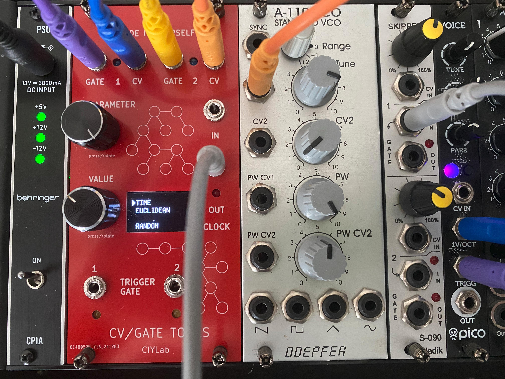

## À quoi ça sert ?

À générer des CV/Gate dans un rack.

## Exemple de configuration 

Dans un rack on peut simultanément générer :
- un kick
- un snare
- une ligne de basse
- une mélodie
- une clock pour synchroniser un autre module

